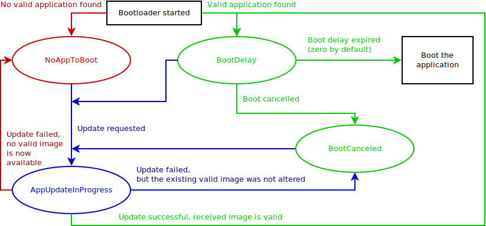

# Kochergá

[](https://forum.zubax.com)
[](https://forum.uavcan.org)

**Kochergá is a robust platform-agnostic [UAVCAN](https://uavcan.org) bootloader for deeply embedded systems.**

Technical support is provided on the [UAVCAN Forum](https://forum.uavcan.org/).

A standard-compliant implementation of the software update server is provided in
[Yakut](https://github.com/UAVCAN/yakut#updating-node-software).

## Features

- **Portability** -- Kochergá is written in standard C++17 and is distributed as a header-only library with no external
  dependencies.

- **Robustness** -- Kochergá is brick-proof. The application (i.e., firmware) update process can be interrupted at any
  point (e.g., by turning off the power supply or by disconnecting the interface), and it is guaranteed that the device
  will always end up in a known valid state. If a dysfunctional application image is uploaded, Kochergá can regain
  control after a watchdog reset.

- **Safety** -- Kochergá verifies the correctness of the application image with a 64-bit hash before every boot.
  Kochergá's own codebase features extensive test coverage.

- **Multiple supported transports:**
  - **UAVCAN/CAN** -- supports both v1 and the legacy v0, the protocol version is auto-detected at runtime.
  - **UAVCAN/serial**
  - More may appear in the future -- new transports are easy to add.

## Usage

### Integration

The entire library is contained in the header file `kocherga.hpp`; protocol implementations are provided each in a
separate header file named `kocherga_*.hpp`. Kochergá does not have any compilation units of its own.

To integrate Kochergá into your application, just include this repository as a git subtree/submodule, or simply
copy-paste the required header files into your source tree.

For reference, a typical implementation on an ARM Cortex M4 MCU supporting
UAVCAN/serial (USB+UART) and UAVCAN/CAN (v1+v0) would set you back by about ~32K of flash.

### Application signature

The bootloader looks for an instance of the `AppInfo` structure located in the ROM image of the application at every
boot. Only if a valid `AppInfo` structure is found the application will be launched. It is recommended to allocate the
structure closer to the beginning of the image in order to speed up its verification. The structure is defined as
follows:

Offset | Type     | Description
-------|----------|-----------------------------------------------------------------------------------------------------
-16    |`uint64`  | Constant value 0x5E4415146FC0C4C7 used for locating the descriptor and detecting the byte order.
-8     |`uint8[8]`| Set to `APDesc00`; used for compatibility with legacy deployments.
0      |`uint64`  | CRC-64-WE of the entire application image when this field itself is set to zero.
8      |`uint32`  | Size of the application image, in bytes. Note that the image must be padded to eight bytes.
12     |`void32`  | Reserved. Used to contain the 32-bit version control system revision ID; see replacement below.
16     |`uint8[2]`| Major and minor semantic version numbers.
18     |`uint8`   | Flags: 1 - this is a release build; 2 - this is a dirty build (uncommitted changes present).
19     |`void8`   | Reserved; set to 0.
20     |`uint32`  | UNIX UTC build timestamp; i.e., the number of seconds since 1970-01-01T00:00:00Z.
24     |`uint64`  | Version control system (VCS) revision ID (e.g., the git commit hash).
32     |`void64`  | Reserved.
40     |`void64`  | Reserved.

When computing the application image CRC, the process will eventually encounter the location where the CRC itself is
stored. In order to avoid recursive dependency, the CRC storage location must be replaced with zero bytes when
computing/verifying the CRC. The parameters of the CRC-64 algorithm are the following:

* Initial value: 0xFFFF'FFFF'FFFF'FFFF
* Polynomial: 0x42F0'E1EB'A9EA'3693
* Reverse: no
* Output xor: 0xFFFF'FFFF'FFFF'FFFF
* Check: 0x62EC'59E3'F1A4'F00A

The CRC and size fields cannot be populated until after the application binary is compiled and linked. One possible way
to populate these fields is to initialize them with zeroes in the source code, and then use the
script `tools/kocherga_image.py` after the binary is generated to update the fields with their actual values. The script
can be invoked from the build system (e.g., from a Makefile rule) trivially as follows:

```sh
kocherga_image.py application-name-goes-here.bin
```

The output will be stored in a file whose name follows the pattern expected by the firmware update server implemented in
the [Yakut CLI tool](https://github.com/UAVCAN/yakut#updating-node-software).

### State machine

The following diagram documents the state machine of the bootloader:



The bootloader states are mapped onto UAVCAN node states as follows:

Bootloader state     | Node mode       | Node health| Vendor-specific status code
---------------------|-----------------|------------|-------------------------------
NoAppToBoot          |`SOFTWARE_UPDATE`| `WARNING`  | 0
BootDelay            |`SOFTWARE_UPDATE`| `NOMINAL`  | 0
BootCancelled        |`SOFTWARE_UPDATE`| `ADVISORY` | 0
AppUpdateInProgress  |`SOFTWARE_UPDATE`| `NOMINAL`  | number of read requests, always >0

### API usage

The following snippet demonstrates how to integrate Kochergá into your bootloader executable.
User-provided functions are shown in `SCREAMING_SNAKE_CASE()`.
This is a stripped-down example; the full API documentation is available in the header files.

The integration test application available under `/tests/integration/bootloader/` may also be a good reference.

#### ROM interface

The ROM backend abstracts the specifics of reading and writing your ROM (usually this is the on-chip flash memory).

```c++
class MyROMBackend final : public kocherga::IROMBackend
{
    auto write(const std::size_t offset, const std::byte* const data, const std::size_t size) override
        -> std::optional<std::size_t>
    {
        if (WRITE_ROM(offset, data, size))
        {
            return size;
        }
        return {};  // Failure case
    }

    auto read(const std::size_t offset, std::byte* const out_data, const std::size_t size) const override
        -> std::size_t
    {
        return READ_ROM(offset, out_data, size);  // Return the number of bytes read (may be less than size).
    }
};
```

#### Media layer interfaces

Transport implementations --- UAVCAN/CAN, UAVCAN/serial, etc., depending on which transports you need ---
are interfaced with your hardware as follows.

```c++
class MySerialPort final : public kocherga::serial::ISerialPort
{
    auto receive() -> std::optional<std::uint8_t> override
    {
        if (SERIAL_RX_PENDING())
        {
            return SERIAL_READ_BYTE();
        }
        return {};
    }

    auto send(const std::uint8_t b) -> bool override { return SERIAL_WRITE_BYTE(b); }
};
```

```c++
class MyCANDriver final : public kocherga::can::ICANDriver
{
    auto configure(const Bitrate&                                  bitrate,
                   const bool                                      silent,
                   const kocherga::can::CANAcceptanceFilterConfig& filter) -> std::optional<Mode> override
    {
        tx_queue_.clear();
        CAN_CONFIGURE(bitrate, silent, filter);
        return Mode::FD;  // Or Mode::Classic if CAN FD is not supported by the CAN controller.
    }

    auto push(const bool          force_classic_can,
              const std::uint32_t extended_can_id,
              const std::uint8_t  payload_size,
              const void* const   payload) -> bool override
    {
        const std::chrono::microseconds now = GET_TIME_SINCE_BOOT();
        // You can use tx_queue_.size() to limit maximum depth of the queue.
        const bool ok = tx_queue_.push(now, force_classic_can, extended_can_id, payload_size, payload);
        pollTxQueue(now);
        return ok;
    }

    auto pop(PayloadBuffer& payload_buffer) -> std::optional<std::pair<std::uint32_t, std::uint8_t>> override
    {
        pollTxQueue();  // Check if the HW TX mailboxes are ready to accept the next frame from the SW queue.
        return CAN_POP(payload_buffer.data());  // The return value is optional(can_id, payload_size).
    }

    void pollTxQueue(const std::chrono::microseconds now)
    {
        if (const auto* const item = tx_queue_.peek())         // Take the top frame from the prioritized queue.
        {
            const bool expired = now > (item->timestamp + kocherga::can::SendTimeout);  // Drop expired frames.
            if (expired || CAN_PUSH(item->force_classic_can,   // force_classic_can means no DLE, no BRS.
                                    item->extended_can_id,
                                    item->payload_size,
                                    item->payload))
            {
                tx_queue_.pop();    // Enqueued into the HW TX mailbox or expired -- remove from the SW queue.
            }
        }
    }

    // Some CAN drivers come with built-in queue (e.g., SocketCAN), in which case this will not be needed.
    // The recommended heap is https://github.com/pavel-kirienko/o1heap.
    kocherga::can::TxQueue<void*(*)(std::size_t), void(*)(void*)> tx_queue_(&MY_MALLOC, &MY_FREE);
};
```

#### Passing arguments from the application

When the application is commanded to upgrade itself, it needs to store relevant context into a struct,
write this struct into a pre-defined memory location, and then reboot.
The bootloader would check that location to see if there is a valid argument struct in it.
Kochergá provides a convenient class for that --- `kocherga::VolatileStorage<>` ---
which checks the presence and validity of the arguments with a strong 64-bit CRC.

```c++
/// The application may pass this structure when rebooting into the bootloader.
/// Feel free to modify the contents to suit your system.
/// It is a good idea to include an explicit version field here for future-proofing.
struct ArgumentsFromApplication
{
    bool linger;        ///< Whether to boot immediately or to wait for commands.

    std::uint16_t uavcan_serial_node_id;                    ///< Invalid if unknown.

    std::pair<std::uint32_t, std::uint32_t> uavcan_can_bitrate;             ///< Zeros if unknown.
    std::uint8_t                            uavcan_can_protocol_version;    ///< v0 or v1; 0xFF if unknown.
    std::uint8_t                            uavcan_can_node_id;             ///< Invalid if unknown.

    std::uint8_t                  trigger_node_index;       ///< 0 - serial, 1 - CAN, >1 - none.
    std::uint16_t                 file_server_node_id;      ///< Invalid if unknown.
    std::array<std::uint8_t, 256> remote_file_path;         ///< Null-terminated string.
};
static_assert(std::is_trivial_v<ArgumentsFromApplication>);
```

#### Running the bootloader

```c++
#include <kocherga_serial.hpp>  // Pick the transports you need.
#include <kocherga_can.hpp>     // In this example we are using UAVCAN/serial + UAVCAN/CAN.

/// Maximum possible size of the application image for your platform.
static constexpr std::size_t MaxAppSize = 1024 * 1024;

int main()
{
    // Check if the application has passed any arguments to the bootloader via shared RAM.
    // The address where the arguments are stored obviously has to be shared with the application.
    // If the application uses heap, then it might be a good idea to alias this area with the heap.
    const std::optional<ArgumentsFromApplication> args =
        kocherga::VolatileStorage<ArgumentsFromApplication>(reinterpret_cast<std::uint8_t*>(0x2000'4000U)).take();

    // Initialize the bootloader core.
    MyROMBackend rom_backend;
    kocherga::SystemInfo system_info = GET_SYSTEM_INFO();
    kocherga::Bootloader boot(rom_backend, system_info, MaxAppSize, args && args->linger);
    // It's a good idea to check if the app is valid and safe to boot before adding the nodes.
    // This way you can skip the potentially slow or disturbing interface initialization on the happy path.
    // You can do it by calling poll() here once.

    // Add a UAVCAN/serial node to the bootloader instance.
    MySerialPort serial_port;
    kocherga::serial::SerialNode serial_node(serial_port, system_info.unique_id);
    if (args && (args->uavcan_serial_node_id <= kocherga::serial::MaxNodeID))
    {
        serial_node.setLocalNodeID(args->uavcan_serial_node_id);
    }
    boot.addNode(&serial_node);

    // Add a UAVCAN/CAN node to the bootloader instance.
    std::optional<kocherga::can::ICANDriver::Bitrate> can_bitrate;
    std::optional<std::uint8_t>                       uavcan_can_version;
    std::optional<kocherga::NodeID>                   uavcan_can_node_id;
    if (args)
    {
        if (args->uavcan_can_bitrate.first > 0)
        {
            can_bitrate = ICANDriver::Bitrate{args.uavcan_can_bitrate.first, args.uavcan_can_bitrate.second};
        }
        uavcan_can_version = args->uavcan_can_protocol_version;     // Will be ignored if invalid.
        uavcan_can_node_id = args->uavcan_can_node_id;              // Will be ignored if invalid.
    }
    MyCANDriver can_driver;
    kocherga::can::CANNode can_node(can_driver,
                                    system_info.unique_id,
                                    can_bitrate,
                                    uavcan_can_version,
                                    uavcan_can_node_id);
    boot.addNode(&can_node);

    // Trigger the update process internally if the required arguments are provided by the application.
    if (args && (args->trigger_node_index < 2))
    {
        (void) boot.trigger(args->trigger_node_index,                   // Use serial or CAN?
                            args->file_server_node_id,                  // Which node to download the file from?
                            std::strlen(args->remote_file_path.data()), // Remote file path length.
                            args->remote_file_path.data());
    }

    while (true)
    {
        const auto uptime = GET_TIME_SINCE_BOOT();
        if (const auto fin = boot.poll(std::chrono::duration_cast<std::chrono::microseconds>(uptime)))
        {
            if (*fin == kocherga::Final::BootApp)
            {
                BOOT_THE_APPLICATION();
            }
            if (*fin == kocherga::Final::Restart)
            {
                RESTART_THE_BOOTLOADER();
            }
            assert(false);
        }
        // Sleep until the next hardware event (like reception of CAN frame or UART byte) but no longer than
        // 1 second. A fixed sleep is also acceptable but the resulting polling interval should be adequate
        // to avoid data loss (about 100 microseconds is usually ok).
        WAIT_FOR_EVENT();
    }
}
```

#### Building a compliant application image

Define the following application signature structure somewhere in your application:

```c++
struct AppDescriptor
{
    std::uint64_t               magic = 0x5E44'1514'6FC0'C4C7ULL;
    std::array<std::uint8_t, 8> signature{{'A', 'P', 'D', 'e', 's', 'c', '0', '0'}};

    std::uint64_t                               image_crc  = 0;     // Populated after build
    std::uint32_t                               image_size = 0;     // Populated after build
    [[maybe_unused]] std::array<std::byte, 4>   _reserved_a{};
    std::uint8_t                                version_major = SOFTWARE_VERSION_MAJOR;
    std::uint8_t                                version_minor = SOFTWARE_VERSION_MINOR;
    std::uint8_t                                flags =
#if RELEASE_BUILD
        Flags::ReleaseBuild
#else
        0
#endif
    ;
    [[maybe_unused]] std::array<std::byte, 1>   _reserved_b{};
    std::uint32_t                               build_timestamp_utc = TIMESTAMP_UTC;
    std::uint64_t                               vcs_revision_id     = GIT_HASH;
    [[maybe_unused]] std::array<std::byte, 16>  _reserved_c{};

    struct Flags
    {
        static constexpr std::uint8_t ReleaseBuild = 1U;
        static constexpr std::uint8_t DirtyBuild   = 2U;
    };
};

static const volatile AppDescriptor g_app_descriptor;
// Optionally, use explicit placement near the beginning of the binary:
//      __attribute__((used, section(".app_descriptor")));
// and define the .app_descriptor section in the linker file.
```

Then modify your build script to invoke `kocherga_image.py` as explained earlier.

#### Rebooting into the bootloader from the application

If the application needs to pass arguments to the bootloader, it can be done with the help of
`kocherga::VolatileStorage<>`.
Ensure that the definition of `ArgumentsFromApplication` used by the application and by the bootloader use
the same binary layout.

Note that the application does not need to depend on the Kochergá library.
It is recommended to copy-paste relevant pieces from Kochergá instead; specifically:

- `kocherga::VolatileStorage<>`
- `kocherga::CRC64`

## Revisions

### v0.2

- Add helper `kocherga::can::TxQueue`.
- Promote `kocherga::CRC64` to public API.
- Add optional support for legacy app descriptors to simplify integration into existing projects.
- Minor doc and API enhancements.

### v0.1

The first revision to go public.
